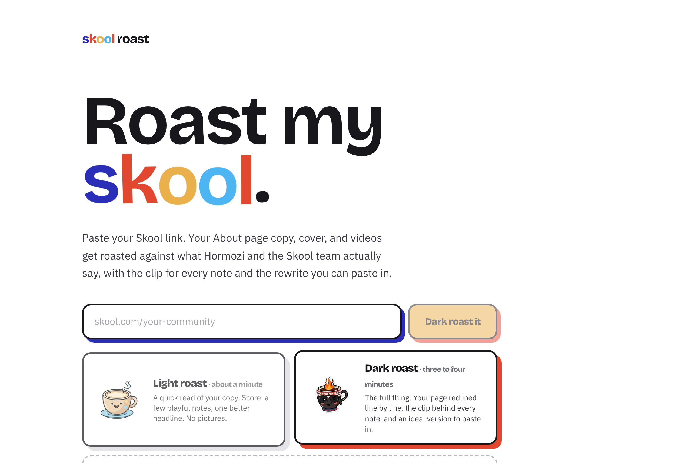
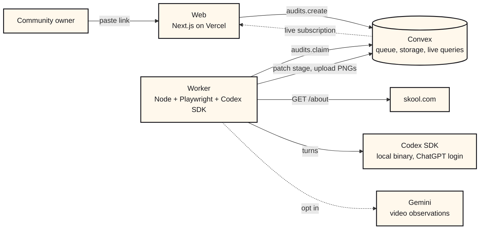
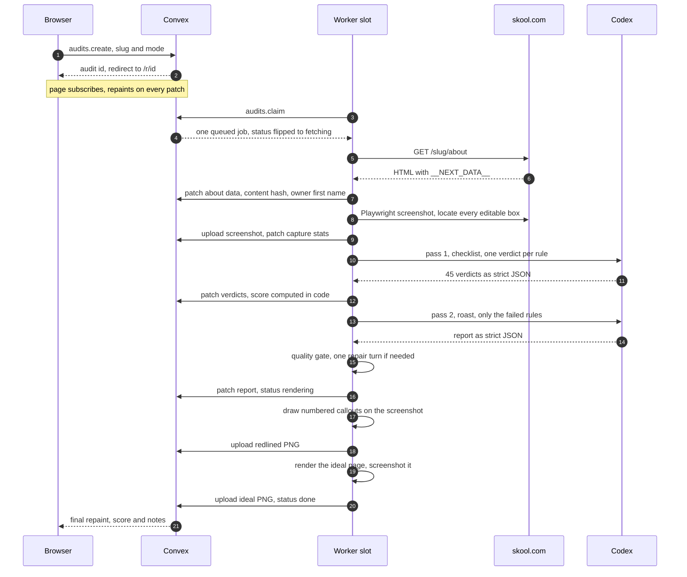
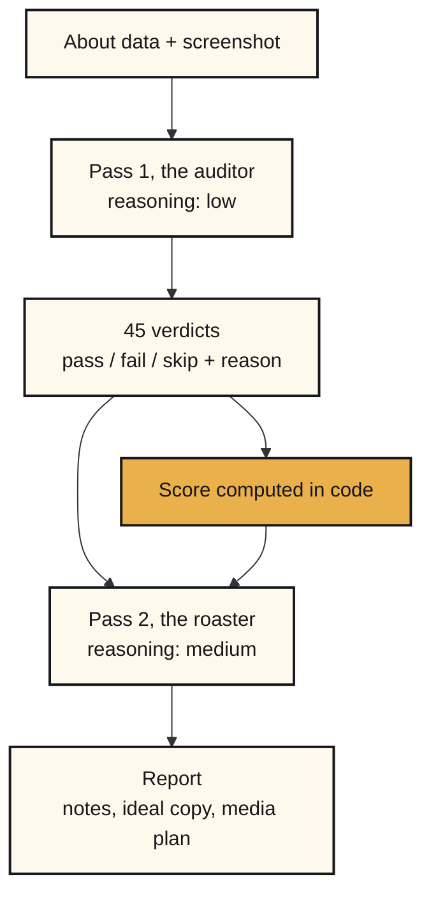
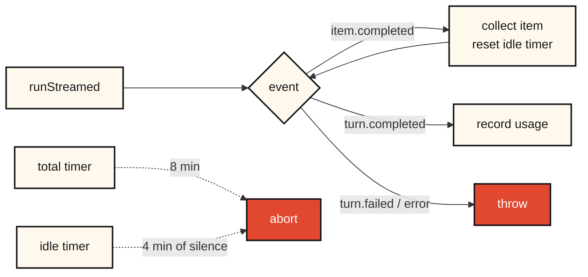
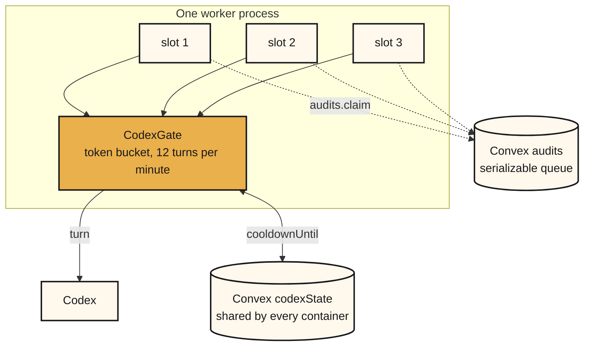
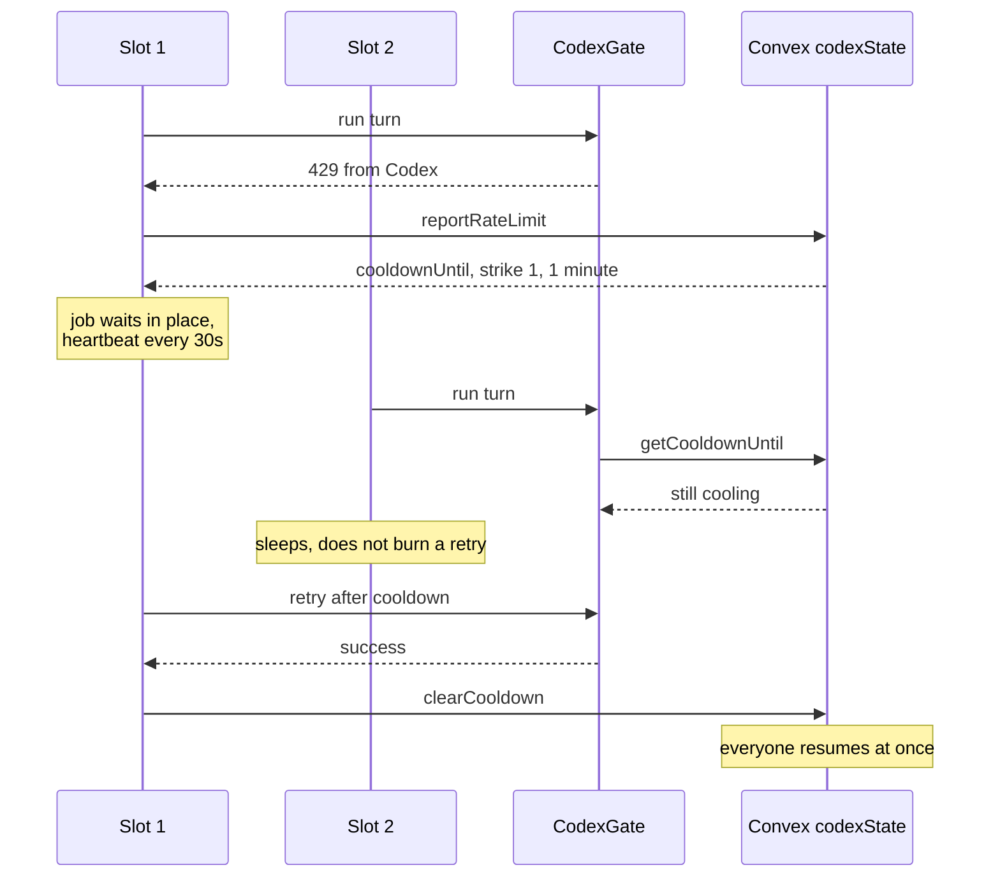
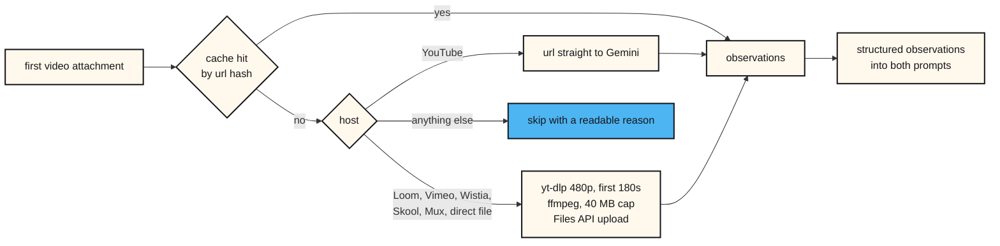
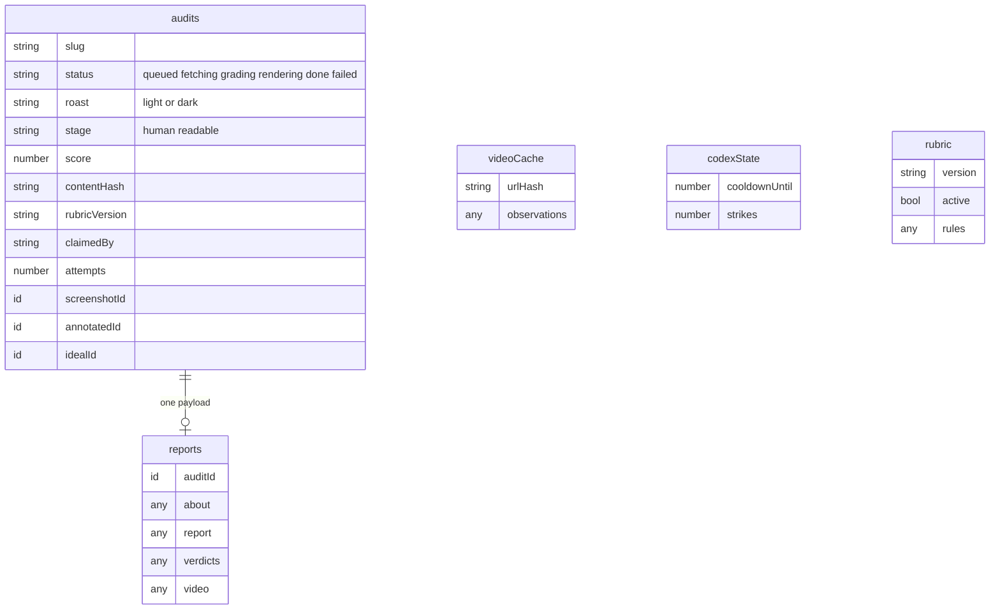

<div align="center">


# Skool Roast

**Paste a Skool link. Get your About page graded against what Alex Hormozi and the Skool team actually said, redlined on a screenshot of your own page, with the clip behind every note and a rewrite you can paste straight back into Skool.**

[skoolroast.vercel.app](https://skoolroast.vercel.app) · built for the [Early AI-dopters](https://www.skool.com/earlyaidopters) community


</div>

---

## Table of contents

| Section | What it covers |
|---|---|
| [What it does](#what-it-does) | The two roast modes and the four artifacts you get back |
| [How it works, in plain English](#how-it-works-in-plain-english) | The whole system with no jargon. Start here. |
| [Architecture](#architecture) | Three moving parts and why they are split that way |
| [Anatomy of a roast](#anatomy-of-a-roast) | Every step of a dark roast, in order |
| [The pipeline, step by step](#the-pipeline-step-by-step) | All 14 steps with code, timing, and failure behaviour |
| [Repo map](#repo-map) | Every file and what it owns |
| [Reading a Skool page](#reading-a-skool-page) | No login, no scraping guesswork |
| [Capture and redline](#capture-and-redline) | How a note lands on the exact line it is about |
| [The rubric](#the-rubric) | 45 rules, every one with a citation |
| [Two passes and a deterministic score](#two-passes-and-a-deterministic-score) | Why the number is stable and the jokes are not |
| [What the model is told](#what-the-model-is-told) | The actual prompts, verbatim |
| [The Codex SDK](#the-codex-sdk) | How inference actually runs here |
| [Concurrency and rate limits](#concurrency-and-rate-limits) | Three layers of throttle, and what happens at a 429 |
| [The video pass](#the-video-pass) | Opt-in VSL analysis |
| [The quality gate](#the-quality-gate) | Deterministic checks and one repair turn |
| [Share cards](#share-cards) | One PNG per roast, rendered on demand |
| [Data model](#data-model) | Five tables, and the slim and fat split |
| [The web app](#the-web-app) | Routes and live updates |
| [Configuration](#configuration) | Every environment variable |
| [Run it locally](#run-it-locally) | Five commands |
| [Deploy](#deploy) | Convex, Vercel, Railway |
| [Troubleshooting](#troubleshooting) | Symptoms, causes, fixes |
| [Failure modes](#failure-modes) | What breaks and what happens next |
| [Adding or changing a rule](#adding-or-changing-a-rule) | The one thing most people will want to edit |
| [Data, privacy, and what is public](#data-privacy-and-what-is-public) | What is sent where, what is stored, who can see it |
| [Design notes](#design-notes) | The opinions baked into the grader |
| [By the numbers](#by-the-numbers) | What the first week actually looked like |
| [Glossary](#glossary) | Every term used here, in one sentence each |

---

## What it does

A Skool About page has exactly five editable surfaces. The community name, the sidebar headline, the About body, the cover image, and up to six attachments where slot 1 is the main video. Everything else on that page is Skool's product, not your copy. This app grades those five surfaces and refuses to comment on anything else.

<table>
<tr>
<td width="90" align="center"></td>
<td>

**Light roast** · about a minute

Text only. Runs the checklist, writes three to five notes with the fix already written for you, and rewrites your sidebar headline. No screenshot, so cover and video rules are skipped and the score is computed from the rules it could judge.

</td>
</tr>
<tr>
<td align="center"></td>
<td>

**Dark roast** · three to four minutes

Screenshots your live page, grades every rule including the visual ones, marks up the screenshot in place with numbered callouts, judges all six attachment slots one by one, builds an ideal version of the page, and hands you paste ready copy. Optionally watches the first three minutes of your video.

</td>
</tr>
</table>

Every finished roast returns four things.

1. **A score out of 100** with a one line verdict, computed deterministically from the rule verdicts rather than from vibes.
2. **Numbered notes**, each quoting your actual words, each ending in the concrete replacement line, each citing the speaker, video, and timestamp it came from.
3. **Your page, redlined.** A screenshot of your own About page with translucent highlights on the exact copy lines, dashed boxes on the cover and thumbnails, and numbered markers matching the notes.
4. **The rewrite.** A sidebar headline and About body under Skool's 150 and 1,000 character caps, plus a slot by slot media plan and a cover direction.

<div align="center"></div>

---

## How it works, in plain English

Skip this if you write software. It is here so anyone in the community can follow the rest.

**The problem.** A Skool About page is a sales page. Most people write theirs once, describe the topic instead of the result, fill all six attachment slots because they exist, and never look at it again. The advice for fixing that is real and public, sitting in about 77 Skool News episodes and a pile of Skool Games recordings, but nobody is going to watch 60 hours of video to find the eight minutes that apply to them.

**The idea.** Pull the advice out of those videos once, turn it into a checklist, and have a model apply the checklist to your page. Every note points at the clip it came from, so you can check the source rather than trusting the robot.

**What actually happens when you paste your link.**

1. The website writes your request on a list and sends you to a page that watches that list entry. Nothing is computed yet.
2. A separate program running on a real computer somewhere is watching the same list. It picks your request up and marks it as taken so nobody else grabs it.
3. That program downloads your About page the same way a browser would, and pulls out your headline, your body copy, your cover, and your six attachment slots.
4. It opens a real invisible browser, loads your page, takes a photo of it, and writes down the exact position of every sentence and every image on that photo. This is what lets it draw a circle around the right line later.
5. It sends the checklist, your page, and the photo to the model and asks one question at a time. Does this page pass rule 1, yes or no, and why. It does that for all 45 rules.
6. Your score is then plain arithmetic on those answers. No opinion involved. That is why re-running it on an unchanged page gives the exact same number.
7. It sends a second request that says, here are the rules this page failed, now write the roast. Only the failures. That keeps the jokes and the score describing the same page.
8. It checks the model's homework against a list of rules of its own. Are the quotes real. Is the rewrite under Skool's character limit. Did it sneak in a phrase like unlock your potential. Anything that fails goes back once for a fix.
9. It draws the numbered circles on the photo, builds a mock of what your page should look like, uploads both, and marks the list entry finished.
10. Your page, which has been watching that entry the whole time, repaints itself with the finished roast.

**The kitchen.** The part people ask about most is what happens when 40 people paste links at once. Picture a kitchen with one oven.

| In the kitchen | In the app |
|---|---|
| A rail of order tickets | The queue of roasts waiting |
| Three cooks taking the next ticket | Three job slots, each working one roast |
| A cook grabbing a ticket off the rail | Claiming a job so no two cooks make the same order |
| One oven everyone shares | One ChatGPT login backing every request |
| A rule that only so many trays go in per minute | The throttle that paces requests to the model |
| The oven overheats and everyone waits | A rate limit, where every worker pauses together |
| Someone checking for abandoned tickets | The cleanup loop that requeues stuck jobs |
| Finishing the orders on the pass before closing | Finishing active roasts before the program exits |

Nobody's order gets thrown out when the oven is busy. It waits, and the screen tells them how long. That is the entire design goal.

## Architecture

Three parts, split along one line. Anything that needs a Codex login runs on a machine with a Codex login. Everything else is stateless and hosted.



**Why the worker is separate.** Inference runs through the Codex SDK on a ChatGPT login, not a metered API key. The SDK spawns a local binary and reads credentials from disk, so it cannot run in a Vercel function. Keeping it out of the request path also means a three minute roast never fights a serverless timeout, and the browser never holds a connection open while the work happens.

> **In plain English.** The website and the thinking are two separate programs. The website is cheap, always on, and does no real work. The thinking happens on a computer that is signed in to ChatGPT, because that is where the free inference lives. They talk to each other through a shared list of jobs.

**Why Convex in the middle.** It is the queue, the job state, the file storage, and the live updates in one place. The report page subscribes to a row and repaints itself as the worker patches it, so there is no polling code in the front end and no websocket server to run.

---

## Anatomy of a roast

A dark roast, start to finish.



Measured across the first 225 finished roasts, a light roast has a median of 92 seconds and a dark roast a median of 233 seconds, with a 90th percentile of 347 seconds. The two model passes are most of that. The rest is one page fetch, one screenshot, and three image uploads.

---

## The pipeline, step by step

Every step of a dark roast, in order, with the code that runs it, what it writes, how long it takes, and what happens when it breaks. A light roast runs steps 1, 2, 3, 7, 8, 9, 10, and 14 only.

### 1. The request is queued

`convex/audits.ts` · `audits.create` · instant

The browser normalizes what you pasted into a slug, then calls one mutation. Before inserting, it checks three things. An identical roast of the same community in the same mode still running from the last ten minutes returns that existing job instead of a second one. Six roasts of one community inside ten minutes is refused. More than 60 jobs already queued is refused. The row is inserted with status `queued`, and the browser is redirected to `/r/<id>` which subscribes to it immediately.

**Writes** a new `audits` row. **If it fails** you get a readable sentence in the form, and nothing is queued.

### 2. A slot claims it

`convex/audits.ts` · `audits.claim` · instant

Each of the three slots asks for work on a loop. The mutation reads the oldest `queued` row and flips it to `fetching` in the same transaction, stamping `claimedBy`, `claimedAt`, `startedAt`, and incrementing `attempts`. Because the database runs mutations one at a time, two slots cannot take the same row.

**Writes** status, `claimedBy`, `attempts`. **If it fails** the slot logs it, sleeps, and asks again. Your job stays queued.

### 3. Your About page is read

`src/lib/skool.ts` · `fetchSkoolAbout` · under a second

One plain GET with a browser user agent. The `__NEXT_DATA__` payload is parsed into the display name, sidebar headline, About body, privacy, member and post counts, courses, reviews with text, prices, join questions, cover, owner name and bio, and all six attachment slots. Wrapped in three retries with backoff, though a genuine 404 fails immediately rather than retrying.

**Writes** the parsed page to `reports.about`, plus `contentHash`, `rubricVersion`, `ownerFirstName`, `previousScore`, `pageChanged`. **If it fails** the roast fails with a plain message such as no community found at that address.

### 4. The page is screenshotted and measured

`worker/capture.mts` · `captureAbout` · about 10 seconds

Headless Chromium loads the live page at 1280 wide and waits for it to settle. One script then records the pixel box of the sidebar name, the sidebar headline, the cover, the main media frame, each attachment thumbnail left to right, and every individual line of the About body. Skool's own buttons, prices, reviews, and counters are deliberately not recorded. A full page PNG is uploaded to storage.

**Writes** `screenshotId` and `captureStats`, which counts the boxes found. **If it fails** the dark roast fails, because there is nothing to redline.

### 5. The video is watched, if you asked

`worker/video.mts` · `analyzeVideo` · about 60 seconds, skipped by default

Only when the box was ticked and the feature is enabled. Cache is checked by a hash of the video url first. YouTube links go straight to the model as a url. Other supported hosts are downloaded at 480p, trimmed to the first three minutes, capped at 40 MB, and uploaded. Anything else is skipped with a sentence explaining why.

**Writes** `reports.video`, and the cache row. **If it fails** the roast continues and the reason is shown to you verbatim. This step can never fail a roast.

### 6. The checklist is prepared

`worker/grade.mts` · `loadRules` · instant

The active rubric comes from the database, not the file on disk, refreshed on a five minute timer. A content hash of your editable surfaces plus the rubric version is compared against your last roast of the same community. If nothing changed and the previous roast carried at least as much evidence, the previous verdicts are reused and step 7 is skipped entirely.

**Writes** `verdictsFrom` set to `cache` or `fresh`.

### 7. Pass one, the checklist

`worker/grade.mts` · `judgeRules` · 40 to 90 seconds

One model turn at low reasoning effort. It receives the 45 rules with their check text, the flattened page, the video observations if any, and the screenshot as an image. It returns one verdict per rule, each `pass`, `fail`, or `skip`, each with a one line reason. The response is schema enforced, then filtered for unknown ids and duplicates.

**Writes** `reports.verdicts`. **If it stalls** it retries twice on a fresh thread. **If it is rate limited** it waits in place and retries up to six times.

### 8. The score is computed

`worker/grade.mts` · `scoreFromVerdicts` · instant

No model involved. Skipped rules are dropped, then the weights of passed rules are divided by the weights of judged rules and multiplied by 100.

**Writes** `score` on the audit row.

### 9. Pass two, the roast

`worker/grade.mts` · `gradeDark` or `gradeLight` · 60 to 180 seconds

A second turn at medium reasoning. It receives the voice guide, the writing rules, the scope limits, the whole rubric for citation text, the flattened page, the screenshot, the score, and the list of failed rules with the auditor's reason for each. It may merge two failures into one note. It may not add a failure that is not on that list. Output is schema enforced.

**Writes** `reports.report`. **If it stalls or is limited** same policy as step 7.

### 10. The output is checked

`worker/quality.mts` · `checkDark` or `checkLight` · instant

Deterministic checks run against the report. Quotes must appear verbatim in your actual body copy. The rewrite must fit Skool's character caps. Banned phrases, generic advice, over long jokes, duplicate titles, bad slot numbers, external links, and streak emojis are all rejected. Anything that fails goes back to the same thread once as a repair prompt, and the repaired version only ships if it has fewer problems than the original.

**Writes** `report.quality`, the list of anything still failing, which is stored rather than hidden. **If the repair fails** the first report ships unchanged.

### 11. The screenshot is redlined

`worker/annotate.mts` · `annotate` · about 3 seconds

Each note is resolved to a box. Body notes match their quote against the captured lines with four strategies in order, exact, substring, reverse substring, then a fuzzy word overlap needing at least three shared words over three characters. Text hits get a translucent highlight and an underline in the severity colour, media hits get a dashed box, and numbered markers are placed to the left and pushed down when they would collide.

**Writes** `annotatedId`, and `located`, a true or false per note. **If a note cannot be placed** it is left off the image rather than drawn in the wrong place, and still appears in the list.

### 12. The ideal page is rendered

`worker/ideal.mts` and `worker/capture.mts` · `idealHtml` then `renderHtml` · about 4 seconds

The rewritten headline and body are poured into a Skool lookalike template with the media plan shown slot by slot, then screenshotted.

**Writes** `idealId`.

### 13. A cover concept is generated, if enabled

`worker/grade.mts` · `generateCover` · about 60 seconds, off by default

The only turn allowed to write to disk. If it fails the roast finishes without it.

**Writes** `coverIdeaId`.

### 14. The roast is marked done

`worker/index.mts` · instant

Status flips to `done` and `finishedAt` is stamped. Your page, which has been subscribed since step 1, repaints with the finished report. The per job scratch directory on the worker is deleted.

**Writes** status, `finishedAt`.

### Running alongside all of this

| Loop | Every | What it does |
|---|---|---|
| Slot poll | 4 seconds plus jitter | Ask for the next job |
| Janitor | 60 seconds | Requeue any job with no update for 12 minutes, fail it after 3 attempts |
| Rubric refresh | 5 minutes | Pick up a newly published rubric without a restart |
| Cooldown check | Before every model turn | Read the shared pause from the database and wait it out |
| Heartbeat | 30 seconds while waiting | Patch the stage so the janitor does not steal a job that is only waiting |

---

## Repo map

```
├── src/
│   ├── app/
│   │   ├── page.tsx                 Landing, form, mode picker, recent roasts marquee
│   │   ├── layout.tsx               Fonts, metadata, Convex provider
│   │   ├── globals.css              The whole design system, about 100 lines
│   │   └── r/[id]/
│   │       ├── page.tsx             Live report, stepper, notes, slots, copy blocks
│   │       ├── layout.tsx           Per roast Open Graph metadata
│   │       └── card/route.tsx       Share card PNG, rendered on demand
│   └── lib/
│       ├── skool.ts                 Fetch and parse a public About page
│       └── score.ts                 One colour scale for every score badge
├── convex/
│   ├── schema.ts                    Five tables
│   ├── audits.ts                    Queue, claim, patch, janitor, ETA, video cache
│   ├── codex.ts                     Shared cooldown state
│   └── rubric.ts                    Published rubric versions
├── worker/
│   ├── index.mts                    Slots, job runner, retry policy, drain
│   ├── codex-gate.mts               Token bucket and shared cooldown
│   ├── grade.mts                    Both Codex passes, prompts, scoring
│   ├── capture.mts                  Playwright screenshot and box finding
│   ├── annotate.mts                 Numbered callouts with sharp and SVG
│   ├── ideal.mts                    Skool lookalike template for the rewrite
│   ├── quality.mts                  Deterministic output checks
│   ├── video.mts                    Opt-in VSL pass
│   ├── lib/codex-sdk.mjs            Thin wrapper over @openai/codex-sdk
│   └── *-schema.json               Strict output schemas for each turn
├── knowledge/
│   ├── rubric.json                  45 rules, the grading source of truth
│   ├── rubric.md                    The same rules, readable
│   ├── roast-voice.md               How the notes should sound
│   └── HOW-RUBRIC-WAS-BUILT.md      Provenance of every rule
└── scripts/
    ├── publish-rubric.mts           Push a rubric version to Convex
    ├── loadtest.mts                 Fire N real roasts at the queue
    └── vtt_to_text.py               Captions to timestamped transcripts
```

---

## Reading a Skool page

No login, no headless scraping for the data, no brittle selectors. Skool is a Next.js app that server renders every field into a `__NEXT_DATA__` script tag, so one plain GET returns the whole page state.

```ts
const html = await fetch(url, { headers: { "user-agent": UA } }).then((r) => r.text());
const json = html.match(/<script id="__NEXT_DATA__" type="application\/json">(.*?)<\/script>/s)[1];
const group = JSON.parse(json).props.pageProps.currentGroup;
```

From there the parser pulls the display name, the sidebar headline, the About body, privacy, member and post counts, courses, reviews with their text, monthly and annual price, join questions, the cover, the owner, and all six attachment slots. Several of those fields are JSON encoded strings inside the JSON, so they get parsed a second time.

Two details worth stealing.

**Owner names are not handles.** The grader addresses people by first name, which is only charming when the name is right. A handle like `imjoshhuggett` is not a name, so it is rejected. A handle shaped like `first-last` is accepted and title cased, and Skool's duplicate handle digits are stripped.

<details>
<summary><b>What the model actually receives</b></summary>

The parsed page is flattened into this block. Invented community, real shape.

```text
Community: Example Fitness (skool.com/example-fitness)
Owner: Dana Reyes (bio: 12 years coaching desk workers back to full range)
Privacy: public   Members: 412   Admins: 2   Posts: 1893
Courses: 4   Modules: 37
Pricing shown: monthly $49, annual not shown
Attachments (3 of 6 used): slot 1 = video <loom url>; slot 2 = image https://assets.skool.com/...; slot 3 = image https://assets.skool.com/...
Reviews: 27 (avg 4.9)
Join questions: What hurts most right now? | How many days a week can you train?
Sample reviews:
  - 5/5: Shoulder pain gone in six weeks, first time in years.
  - 5/5: The Monday check in is the only reason I stayed consistent.

HEADLINE (one-liner under the name):
A community for people who care about fitness and mobility

ABOUT BODY:
Welcome! This is a place to learn about mobility, strength and healthy habits...
```

Two things to notice. The attachment slots are numbered in the text, which is what lets a note say slot 4 and mean it. And reviews are truncated, because 200 reviews would crowd out the copy the model is supposed to be reading.

</details>

**The model sees a flattened page, not raw JSON.** `renderAboutForModel` turns the parsed object into a compact block with the attachment slots numbered and reviews truncated, which keeps the prompt small and makes slot numbering unambiguous.

---

## Capture and redline

The dark roast has to put note number three on the exact sentence note number three is about. That happens in two stages.

**Stage one, in the browser.** Playwright loads the page at 1280 wide and runs a locator script that boxes only the editable surfaces. The sidebar name and headline are found by matching text and preferring the rightmost match, since the same words appear twice on the page. The cover is the first wide Skool asset image in the right column. The main media frame is the largest element in the left column, and the thumbnails are the small tiles sitting directly under it, ordered left to right. The About body is the tricky one, because Skool renders it as a container with one div per line and the DOM runs the lines together. The container is matched on whitespace stripped text, then every leaf line inside it gets its own box. Skool's own buttons, prices, reviews, and counters are never boxed.

**Stage two, after grading.** Each issue carries a target and, for body issues, a verbatim quote. The annotator resolves that to a box with a four step match. Exact text, then substring, then reverse substring, then a fuzzy pass that scores shared words longer than three characters and needs at least three of them. Text hits get a translucent highlight and an underline. Media hits get a dashed box. Numbered markers are placed to the left and pushed down when they would collide.

Anything the annotator cannot place is reported back as `located: false` rather than being drawn in the wrong spot, and the note still appears in the list.

---

## The rubric

`knowledge/rubric.json` is the grading source of truth. 45 rules, and every single one carries the speaker, video title, url, and timestamp it came from. The grader is told never to invent advice, and the report page turns each citation into a link that opens the clip at the right second.

| Field | Meaning |
|---|---|
| `id` | Stable identifier, R01 through R73 |
| `category` | offer, headline, body_copy, proof, media, branding, vsl, attachments |
| `surface` | Which editable surface it judges |
| `rule` | The rule in one sentence |
| `check` | What the auditor should look for, written as an instruction |
| `why` | The reason it costs members |
| `weight` | 2 to 5, how much it moves the score |
| `observable` | `full` or `partial`, whether page data alone can settle it |
| `sources` | Up to three citations with speaker, video, url, timestamp |

<details>
<summary><b>A real rule, exactly as it ships</b></summary>

```json
{
  "id": "R01",
  "category": "offer",
  "rule": "Sell the specific outcome the member will get, not vague access to a community.",
  "check": "Check whether the headline or body promises a concrete result (a number, a timeframe, a transformation) rather than just naming a topic or granting access.",
  "why": "A confused or generic promise does not convert; buyers act on a stated outcome.",
  "weight": 5,
  "observable": "full",
  "sources": [
    {
      "speaker": "Alex Hormozi",
      "video_title": "10 Important Small-Big Reminders",
      "video_url": "https://www.skool.com/platinum-august",
      "timestamp": "post"
    },
    {
      "speaker": "Nick Sarv",
      "video_title": "Skool Games Event Recording Q2 2025 ft. Alex Hormozi + The GOAT",
      "video_url": "https://www.youtube.com/watch?v=yW1Y-Imp2H8",
      "timestamp": "58:11"
    }
  ],
  "surface": "about_body"
}
```

The `check` field is what the auditor is given. The `rule` field is what the roaster is given. They are written separately on purpose, because an instruction that makes a good yes or no test makes a stiff piece of writing advice.

</details>

Current spread. 19 rules on the About body, 9 on attachments, 7 on media, 5 on the sidebar headline, 5 on cover or copy. Weight 3 is the most common at 22 rules, with 6 rules at weight 5.

**Where the rules came from.** Captions for all 77 Skool News episodes were pulled with yt-dlp, deduped into timestamped transcripts, and read in chunks by extraction agents that returned checkable rules with evidence. That raw set was deduped and weighted down to the current rubric. Hormozi's pinned reminders and a Skool Games post were added by hand. Fifteen rules come from private page critiques and are cited as such. Transcripts are not committed to this repo.

**Publishing.** The worker grades with the rubric stored in Convex, not the file on disk, and refreshes it every five minutes. That means a rule change goes live without a redeploy.

```bash
npx tsx scripts/publish-rubric.mts --prod
```

The version string is stamped onto every audit, and it is part of the content hash, so bumping the rubric invalidates cached verdicts on its own.

---

## Two passes and a deterministic score

The obvious build asks one model call for a score and some jokes. That produces a number that wanders by five points between identical runs, which destroys the one thing people care about when they fix their page and roast it again.

So grading is split.



**Pass one is a checklist.** Low reasoning, no personality, one verdict per rule with a one line reason. The prompt tells it to be consistent, judge the literal text, and use `skip` only when the data genuinely cannot show the rule. A light roast has no screenshot, so the visual rules come back as `skip`.

**The score is arithmetic, not opinion.**

> **In plain English.** Ask a model for a score and you get a slightly different number every time, which is useless when someone fixes their page and wants to know if it improved. So the model only answers yes or no on each rule, and the score is then straight division on those answers.

```
score = round(100 × Σ weight(passed) / Σ weight(judged))
```

Skipped rules leave the denominator entirely, which is why a light roast can score higher than the dark roast of the same page. The report page shows every verdict behind a disclosure so the number can be audited line by line.

The number maps to a label and a colour, which is all the report page shows above the fold.

| Score | Label | Meaning |
|---|---|---|
| 85 and above | fabulous | The page is doing its job. Notes are polish. |
| 70 to 84 | solid | Good bones, one or two things costing real members |
| 50 to 69 | needs work | The offer is in there somewhere, the page is burying it |
| Below 50 | roasted | A visitor cannot tell what they get or who it is for |

<details>
<summary><b>What pass one returns</b></summary>

```json
{ "verdicts": [
  { "id": "R01", "verdict": "fail", "reason": "Headline names the topic, mobility and habits, but never states an outcome or timeframe." },
  { "id": "R02", "verdict": "pass", "reason": "Body names desk workers with shoulder and hip pain in the first two lines." },
  { "id": "R26", "verdict": "skip", "reason": "No screenshot in a light roast, cannot judge the cover." }
] }
```

Every one of those reasons is carried into pass two and shown on the report page behind the checklist disclosure, so a score can be argued with line by line.

</details>

**Pass two writes the roast** and is handed only the rules that failed, with the auditor's reason attached. It may merge two failures into one note. It may not invent a failure that is not on the list. That keeps the prose and the number describing the same page.

**Verdict caching.** A sha256 of the editable surfaces plus the rubric version is stored on every audit. Re-roast an unchanged page and pass one is skipped entirely, so the score cannot drift. The report says so in a badge, and the moment anything on the page changes, the badge flips and the checklist runs fresh. A previous dark roast can serve a later light roast, since dark carries strictly more evidence, but never the reverse.

---

## What the model is told

The whole thing is a prompt, so here it is. These blocks are pasted straight out of `worker/grade.mts` and go into every grading turn.

**The scope limit.** This is the single most opinionated part of the app. It is why you never get a note about your pricing.

```text
WHAT YOU MAY GRADE (the creator can edit these, nothing else):
- The community display name.
- The sidebar headline (the short description under the name).
- The About body copy (the long text; unicode bold is allowed there, nothing else).
- The sidebar cover image.
- Up to six About attachments: the main video (VSL) and image/video thumbnails.
NEVER grade or mention Skool's own UI: join or trial buttons, pricing tiers, annual billing, reviews, member counts, join questions, levels, categories, classroom. Those are product, not copy. If the only thing wrong is product, say the copy is strong.
```

**The writing rules.**

```text
HOW TO WRITE IT:
- Address the creator by first name in the verdict or summary when the owner is known ("Hey Nick, ..."). Talk to them, not about them.
- Every note quotes their actual words or names the actual image. Never write a note that could apply to any Skool page.
- Every fix for copy is the replacement line itself, in quotes, ready to paste. Not "make it clearer", not "consider". Write it.
- Roast lines are one specific joke about THEIR page, under 22 words, never mean. Then the fix in plain words.
- Ban these in anything you write or rewrite: "no fluff, just results", "remove the guesswork", "stop overthinking", "unlock your potential", "level up", "game-changer", "transform your", "seamless", "leverage", "empower", "journey", "elevate". No em dashes anywhere.
- Plain sentences, contractions, no corporate tone. Sound like a sharp friend who has read 500 About pages.
```

**Pass one, the checklist.** Assembled in `judgeRules`, sent at low reasoning effort with the screenshot attached.

```text
You are auditing the EDITABLE surfaces of a Skool About page against a checklist.
This is a checklist pass, not a roast: for EVERY rule return pass, fail, or skip.
Use skip only when the data truly cannot show it. Be consistent: the same page must
get the same verdicts every time. Judge the literal text and visuals, not intent.

{the scope limit above}

=== CHECKLIST (2026-09-03-v3) ===
R01 [weight 5, about_body] Sell the specific outcome the member will get, not vague access to a community.
   check: Check whether the headline or body promises a concrete result...
... 44 more ...

=== ABOUT PAGE DATA (server-rendered) ===
{your page, flattened}

{video observations, when the video pass ran}

=== SCREENSHOT ===
The attached image is the About page. Use it for cover, main video frame, and thumbnails.
```

**Pass two, the roast.** Assembled in `gradeDark`, sent at medium reasoning with the screenshot attached.

```text
You are Skool Roast, grading the About page of a Skool community for a Skool community
owner. Roast it the way an experienced Skool coach does on a Loom: playful, specific,
quoting their actual words, always followed by the fix. No em dashes. No flattery.
Funny, never cruel.

{knowledge/roast-voice.md, in full}

{the writing rules above}

{the scope limit above}

Every issue cites its rule's source verbatim (speaker, video title, url, timestamp).
Do not invent sources.

The checklist pass is already done. The page scored 66/100. These are the rules it
FAILED, with the auditor's reason; build your notes from these and only these (you may
merge two into one note, never add a failure that is not listed):

R01 [weight 5, about_body] Sell the specific outcome the member will get...
   auditor: Headline names the topic but never states an outcome or timeframe.
   source: Alex Hormozi, "10 Important Small-Big Reminders", https://..., at post
... the rest of the failures ...

Issues: 3 to 8, ordered by what costs the most members. For target=body, "quote" must
be an exact line copied from the About body so it can be redlined on the screenshot...

Attachments: the page has slot 1 (main video) plus up to five thumbnails, left to right,
slots 2 to 6. Judge EACH slot that exists and each empty slot...

Skool limits: the sidebar headline must be under 150 characters; the About body under
1,000 characters. Respect both in the ideal.

Ideal: rewrite ONLY the sidebar headline and the About body. Keep their niche, voice,
and every real fact. Do not invent numbers, testimonials, guarantees, or credentials
they did not state...

=== RUBRIC (2026-09-03-v3) ===
{all 45 rules with their citations}

=== ABOUT PAGE DATA (server-rendered) ===
{your page, flattened}

=== SCREENSHOT ===
The attached image is the About page as a visitor sees it.
```

**The repair turn.** Sent back on the same thread when the quality gate finds problems.

```text
Your report failed these quality checks. Return the FULL corrected report as the same
JSON shape, changing only what is needed:
- issues[2]: quote is not verbatim from the About body: "..."
- ideal.about_body: 1,043 characters; Skool caps the About body at 1,000
```

Three things the model is never given. Your Skool login, because it only reads the public page. Any other community's page. And any freedom over the score, which is computed in code from pass one and simply told to pass two as a fact.

The voice guide injected into pass two is `knowledge/roast-voice.md` in this repo, so the tone is auditable too.

---

## The Codex SDK

Inference runs through [`@openai/codex-sdk`](https://www.npmjs.com/package/@openai/codex-sdk) against a ChatGPT login, so a roast costs nothing per run and the whole thing can be handed to a community for free. `worker/lib/codex-sdk.mjs` is the only file that touches the SDK. Everything else calls two functions.

### Creating a thread

```js
const codex = new Codex({ config: { features: { apps: false, browser_use: false, computer_use: false,
  image_generation: false, multi_agent: false, plugins: false, skill_search: false, workspace_dependencies: false } } });

const thread = codex.startThread({
  workingDirectory: root,
  model,                       // gpt-5.6-sol by default
  modelReasoningEffort: reasoning,
  sandboxMode: "read-only",
  networkAccessEnabled: false,
  webSearchMode: "disabled",
  webSearchEnabled: false,
  approvalPolicy: "never",
  skipGitRepoCheck: true,
});
```

Every grading turn is locked down on purpose.

| Option | Setting | Why |
|---|---|---|
| `sandboxMode` | `read-only` | Grading is a pure function of the prompt. It never needs to write. |
| `networkAccessEnabled` | `false` | Everything it needs is already in the prompt. No fetching, no surprises. |
| `webSearchMode` | `disabled` | Advice must come from the cited rubric, never from the open web. |
| `approvalPolicy` | `never` | Unattended worker. A turn that wants permission is a hung job. |
| `features` | all off | Apps, plugins, multi agent, and skill search are dead weight for a JSON turn and slow startup. |
| `isolated` | `true` | Each grading turn gets a clean feature set, unaffected by the host machine's Codex config. |

The one exception is cover image generation, which runs `workspace-write` because the turn has to copy a PNG into the workspace.

### Strict JSON, not parsed prose

Each turn is given an output schema and the SDK enforces it. Three schemas live in `worker/`.

> **In plain English.** Rather than asking for text and hoping it can be parsed, each request is handed a strict shape it must fill in, like a form with required fields. The response comes back as data the program can use directly, with no guessing about formatting.

| Schema | Turn | Shape |
|---|---|---|
| `verdict-schema.json` | Pass one | `{ verdicts: [{ id, verdict, reason }] }` |
| `report-schema.json` | Dark roast | verdict, summary, issues with target and quote and severity and source, ideal copy, media plan, cover prompt |
| `light-schema.json` | Light roast | verdict, summary, notes, rewritten headline |

<details>
<summary><b>The dark roast schema, field by field</b></summary>

| Field | Type | Constraint |
|---|---|---|
| `verdict` | string | One blunt sentence. A roast, not a report. |
| `summary` | string | Three to five sentences, what works then what costs members |
| `issues[]` | array | 3 to 8 notes |
| `issues[].target` | enum | cover, name, sidebar_headline, body, media, attachment, general |
| `issues[].quote` | string | For a body note, the exact line copied from the page. Empty otherwise. |
| `issues[].slot` | integer | 1 to 6 for attachment notes, where 1 is the main video. 0 otherwise. |
| `issues[].severity` | enum | high, medium, low. Drives the callout colour. |
| `issues[].title` | string | Under 8 words |
| `issues[].roast` | string | The jab, under 18 words |
| `issues[].detail` | string | What is wrong, under 40 words |
| `issues[].fix` | string | The replacement line, under 40 words |
| `issues[].source` | object | speaker, video_title, video_url, timestamp |
| `ideal.sidebar_headline` | string | Under 150 characters, Skool's cap |
| `ideal.about_body` | string | Under 1,000 characters, Skool's cap. First line is the headline in unicode bold. |
| `ideal.cover_direction` | string | What the cover should show, under 40 words |
| `ideal.media_plan[]` | array | One entry per slot, with slot, current, action, should_show |
| `ideal.media_plan[].action` | enum | keep, replace, remove, add |
| `cover_image_prompt` | string | Used only when cover generation is on |

`additionalProperties` is false at every level, so the model cannot invent a field the renderer would silently drop.

</details>

<details>
<summary><b>One note from a finished report</b></summary>

Invented example, real shape.

```json
{
  "target": "body",
  "quote": "Welcome! This is a place to learn about mobility, strength and healthy habits.",
  "slot": 0,
  "severity": "high",
  "title": "The first line sells a topic",
  "roast": "Your opening line could be the About page of a library shelf.",
  "detail": "Line one names three subjects and no result. A visitor still cannot tell what changes for them or by when.",
  "fix": "Open with: \"Get out of desk posture pain in 60 days, training 20 minutes a day at home.\"",
  "source": {
    "speaker": "Alex Hormozi",
    "video_title": "10 Important Small-Big Reminders",
    "video_url": "https://www.skool.com/platinum-august",
    "timestamp": "post"
  }
}
```

The `quote` is what the annotator matches against the screenshot to decide where to draw callout number one.

</details>

```js
const { events } = await thread.runStreamed(prompt, { outputSchema, signal: controller.signal });
```

The response still gets a defensive parse that strips code fences, and pass one filters out any verdict whose id is not in the rubric and any duplicate ids. Trust the schema, verify anyway.

### Multimodal input

The screenshot is passed as a local file next to the text, which is what lets one turn judge the cover, the video thumbnail, and how the copy reads above the fold.

```js
const input = [{ type: "text", text: prompt }, { type: "local_image", path: screenshotPath }];
```

### Streaming with two timeouts

`runCodexTurn` consumes the event stream rather than awaiting a final result, which gives progress, a full event log per job for debugging, and the ability to tell a slow turn apart from a dead one.



Two clocks, because they catch different failures. The **total timeout** catches a turn that is thinking forever. The **idle timeout** catches a turn that has stopped emitting events at all, which is the one that used to strand jobs. Every event is appended to a JSONL file per audit, so a bad roast can be replayed after the fact.

> **In plain English.** A request that is slow and a request that is dead look identical if you only measure total time. So there are two stopwatches. One caps how long the whole thing may take. The other resets every time the model sends any sign of life, and fires if it goes quiet for too long.

An empty final response throws rather than returning, since a silent turn is a stall and not a verdict.

### Thread reuse for the repair turn

When the quality gate finds problems, the repair prompt goes back to **the same thread**. The model still has its own report in context, so the second turn is short and cheap and only has to change what failed.

```js
const repair = `Your report failed these quality checks. Return the FULL corrected report as the same JSON shape,
changing only what is needed:\n${problems.map((p) => `- ${p.where}: ${p.what}`).join("\n")}`;
const r2 = await runCodexTurn({ thread, prompt: repair, outputSchemaPath, timeoutMs: 5 * 60_000 });
```

The repaired version only ships if it has fewer problems than the original. A failed repair keeps the first report rather than failing the roast.

### One funnel for every turn

Every call in `grade.mts` goes through a single wrapper, so no future step can accidentally skip the throttle.

```ts
async function runCodexTurn(opts) {
  return gate ? gate.run(() => rawRunCodexTurn(opts), onWaitHook) : rawRunCodexTurn(opts);
}
```

### Image generation

With `ROAST_COVER_IMAGE=1` the report also gets a cover concept, generated by asking Codex to use its own built in image generation skill and copy the PNG to an exact workspace path. That turn is the only one allowed to write, and if it fails the roast finishes without it.

---

## Concurrency and rate limits

One ChatGPT login backs the whole service. That is the constraint everything else is designed around. Roasts are minutes long, users arrive in bursts after a post goes up, and a rate limit must never turn into a failed roast for someone who is watching a progress bar.

Three layers, from coarse to fine.



### Layer one, claiming work

The worker runs `ROAST_CONCURRENCY` slots in one process, three by default. Each slot is an independent loop that asks Convex for a job, runs it end to end, then immediately asks for another.

```ts
await Promise.all(Array.from({ length: concurrency }, (_, i) => slot(i + 1)));
```

Handing work out is a Convex mutation, and Convex mutations are serializable transactions. The oldest queued row is read and flipped to `fetching` inside one transaction, so two slots, or two containers on two machines, can never take the same job. There is no lock to lease and no lock to leak.

> **In plain English.** Two workers asking for a job at the same instant is the classic way to accidentally run the same job twice. The database here handles requests one at a time, in order, so the read and the claim happen as one indivisible step. The second worker asks a moment later and finds that job already taken.

Each slot identifies itself as `${workerId}#${n}`, where the worker id is the Railway replica or hostname plus the process id, so `claimedBy` says exactly which slot on which machine has a job.

Idle slots poll every `ROAST_POLL_MS` with up to a second of jitter, which stops three slots from waking in lockstep forever.

### Layer two, pacing turns

Slots are about wall clock work. The gate is about model turns. `CodexGate` is a token bucket shared by every slot in the process.

```
tokens = min(perMinute, tokens + elapsed / 60s × perMinute)
```

> **In plain English.** Think of a bucket that refills at a steady drip, 12 drops a minute. Every request to the model costs one drop. If the bucket is empty you wait exactly as long as the next drop takes. That keeps a burst of traffic from slamming into the provider's limit all at once.

A turn takes one token. When the bucket is empty the caller sleeps for exactly as long as the next token needs, then rechecks. Default is 12 turns per minute, and since a dark roast spends two turns plus an occasional repair, that comfortably covers three concurrent roasts without ever bursting into the rate limiter.

### Layer three, the shared cooldown

The first two layers are guesses about the limit. This one is the response to hitting it.

Errors are classified by pattern, covering rate limit, 429, too many requests, usage limit, quota, capacity, overloaded, insufficient quota, and try again later. When one matches, the worker reports it to Convex, which is the single source of truth for a cooldown that every container respects.



Cooldowns escalate on repeat strikes and decay when things are calm.

| Strike | Cooldown | Notes |
|---|---|---|
| 1 | 1 minute | First 429 in a calm period |
| 2 | 2 minutes | |
| 3 | 5 minutes | |
| 4 and beyond | 10 minutes | Ceiling |
| Any | resets to strike 1 | If the last strike was over 30 minutes ago |

The first turn to succeed after a cooldown clears it for everyone, so one lucky probe releases the whole fleet instead of every worker waiting out the full timer.

> **In plain English.** When the provider says slow down, one worker writes the time to resume into the shared database and every other worker reads it and waits too. Without that, three workers would each discover the limit separately and each get punished for it. The first request that succeeds afterwards tells everyone the coast is clear.

### What a rate limit feels like to the user

Nothing fails. `withCodexRetry` catches the rate limit and waits the cooldown out **inside the job**, up to six attempts, while patching the audit row every 30 seconds with a human readable line like `Codex is busy, resuming in about 2 minutes`.

That heartbeat is load bearing. The janitor requeues anything that has not been updated for 12 minutes, so a job silently sleeping through a 10 minute cooldown would be stolen and restarted from the top. Patching every 30 seconds keeps it alive and keeps the progress page honest at the same time.

Stalls are treated differently from limits. A turn that times out or emits no progress event is retried twice **on a fresh thread**, since a wedged thread rarely recovers. A rate limit retries in place on the same thread.

### Everything else that keeps the queue sane

| Mechanism | Where | What it does |
|---|---|---|
| Dedupe | `audits.create` | Same community, same mode, same video setting, still running from the last 10 minutes returns the existing audit |
| Abuse guard | `audits.create` | Six roasts of one community in 10 minutes is refused with a readable message |
| Queue ceiling | `audits.create` | 60 queued jobs refuses new work rather than promising a 40 minute wait |
| Janitor | worker, every 60s | Requeues jobs stale for 12 minutes, fails them after 3 attempts |
| Drain | SIGTERM and SIGINT | Stops claiming, finishes active roasts, exits when the last one lands |
| Runtime cleanup | after each job | Deletes the per audit scratch directory unless `ROAST_KEEP_RUNTIME=1` |
| ETA | `audits.eta` | Averages recent measured durations by mode, divides queued work by concurrency, adds any live cooldown |
| Queue position | `audits.queuePosition` | Counts jobs created before yours plus jobs currently cooking |

The drain matters more than it looks. Railway sends SIGTERM on redeploy, and without a drain every in flight roast would be killed and requeued, so shipping a change during a busy hour would visibly restart people's progress bars.

> **In plain English.** When the worker is told to shut down, it stops taking new jobs but finishes the ones it has, then exits. Without that, deploying an update in the middle of the day would visibly reset the progress bar for everyone mid roast.

### Scaling past one login

Nothing in the design assumes a single container. The claim mutation is serializable and the cooldown lives in Convex, so a second worker is safe to start. It is capacity that does not scale, since both containers share one ChatGPT plan. Run one, and raise `ROAST_CONCURRENCY` and `ROAST_CODEX_TURNS_PER_MIN` instead. Two containers are for redundancy or a second login, not for throughput.

Set `ROAST_FAKE_RATELIMIT=1` to force the next turn to throw a fake 429, which exercises the whole path locally in about a minute.

---

## The video pass

Off by default, opt in per roast, dark roast only. When it is on, a model watches the first three minutes of your main video and the observations feed both grading passes, which flips the video rules from `skip` to judged.



The observations are a strict schema. The hook transcript for the first 15 seconds, whether the opening states an outcome, the format, whether it shows the real thing or only a talking head, whether there is a direct ask, whether captions exist and are readable on a phone, production quality, which of the seven structure beats appear, and a two sentence summary.

Three rules this pass follows without exception. It never fails a roast, since every error path returns a skip with a reason a human wants to read. Videos over 12 minutes are skipped as not a VSL. Results are cached by url hash forever, so re-roasting the same page never rewatches the same video.

---

## The quality gate

Model output is checked in code before it ships. `worker/quality.mts` runs deterministic checks, the failures go back for one repair turn, and whatever survives is stored on the report so nothing is hidden.

| Check | Rule |
|---|---|
| Em dashes | None anywhere, in any generated string |
| Skool caps | Sidebar headline under 150 characters, About body under 1,000 |
| Verbatim quotes | Every body note's quote must appear in the actual About body |
| Real fixes | A body fix must be the replacement line, not a direction |
| Banned phrases | 30 empty marketing phrases refused in the rewrite |
| Generic notes | 11 filler phrases like `consider adding` refused in notes |
| Roast length | One liners capped at 22 words |
| Slots | Attachment issues need a slot from 1 to 6, no duplicate slots in the plan |
| Links and emoji | No external links in the body, no fire, crown, gem, or shamrock, since on Skool those mean streaks and levels |
| Duplicates | No two notes with the same title |
| Address | The owner's first name appears in the verdict or summary when it is known |

<details>
<summary><b>The full banned phrase lists</b></summary>

Refused inside any rewrite, because they say nothing.

`no fluff, just results` · `remove the guesswork` · `stop overthinking` · `you need to know what actually works` · `unlock your potential` · `take it to the next level` · `game-changer` · `level up` · `transform your` · `in today's` · `look no further` · `supercharge` · `unleash` · `elevate your` · `seamless` · `cutting-edge` · `robust` · `dive in` · `delve` · `leverage` · `empower` · `journey` · `ecosystem` · `synergy` · `holistic`

Refused inside a note or a fix, because they are advice shaped rather than advice.

`consider adding` · `you may want to` · `it would be beneficial` · `could be improved` · `make it more engaging` · `add more value` · `be more specific` · `optimize` · `enhance` · `compelling` · `resonate`

The second list is the important one. A note that says be more specific is the exact failure the tool exists to avoid.

</details>

A final `scrub` pass repairs the one thing that can be fixed in code without changing meaning, which is turning any surviving dash into a comma.

---

## Share cards

Every finished roast has a share card at `/r/<id>/card`. One 1200 by 630 PNG with the score, the verdict, and the top three notes ranked by severity, rendered on demand from the stored report with `next/og`.

Because it renders from stored data, every roast ever run has one with no backfill. The same route is the Open Graph image for the report page, so pasting a link into Skool, Slack, or X previews the card.

> **In plain English.** The card is drawn fresh each time somebody asks for it, from the report already saved in the database. That means roasts from before this feature existed have one too. Open Graph is the standard that decides what picture appears when a link is pasted into a chat app.

Two details that cost an hour each. Fonts are vendored as woff files next to the route, since Google's CSS endpoint hands a Node user agent something the renderer would not accept. And note text is normalized with `NFKC` before drawing, because Skool copy is full of unicode bold, which the vendored fonts render as empty boxes.

---

## Data model



The split between `audits` and `reports` is deliberate. The report page subscribes to the audit row and repaints on every patch, so that row is kept under about a kilobyte. A full report with verdicts and parsed page data is closer to 50, and pushing that down the socket on every stage change would make the progress page heavier than the finished one. Fat payloads live in `reports` and are read once, when the roast is done.

> **In plain English.** The progress page updates many times while a roast runs. Every update sends the row it is watching over the network. So the row it watches holds only small things like status and score, and the heavy report is kept in a separate row that is fetched once at the end.

### The vocabulary on a row

Two fields drive everything the user sees. `status` is for the program, `stage` is for the human.

| `status` | Meaning |
|---|---|
| `queued` | On the list, nobody has picked it up |
| `fetching` | A slot has it and is reading the Skool page |
| `grading` | One of the two model passes is running |
| `rendering` | Drawing the redlines and the ideal page |
| `done` | Finished, report is readable |
| `failed` | Gave up, `error` holds a sentence written for a human |

`stage` is free text the worker sets as it goes, and it is what the progress page prints. It exists so a new step can appear in the UI without a front end change.

| `stage` | When |
|---|---|
| `Reading your About page` | Fetch with retries |
| `Taking a screenshot` | Playwright capture |
| `Watching your video` | Optional video pass |
| `Dark roast: running the checklist` | Pass one |
| `Dark roast: page unchanged, reusing your checklist` | Cached verdicts, same page as last time |
| `Dark roast: writing the roast` | Pass two |
| `Redlining your page` | Drawing callouts |
| `Building the ideal version` | Rendering the mock |
| `Codex is busy, resuming in about 2 minutes` | Waiting out a shared cooldown, refreshed every 30s |
| `Codex stalled, starting that step again` | A silent turn, retrying on a fresh thread |
| `Queued again` | The janitor rescued a stalled job |

---

## The web app

| Route | What it is |
|---|---|
| `/` | Landing. Form, mode picker, the optional video checkbox, a marquee of the rules, recent roasts with scores. |
| `/r/<id>` | Live report. Subscribes to the audit row, shows a five step progress list with queue position and ETA while cooking, then the full report. |
| `/r/<id>/card` | Share card PNG, rendered on demand. |

The report page reads three live queries. A slim status row, a queue position, and an ETA. The fat payload is only fetched once status turns `done`. Progress is a five step list driven by a stage string, so a new worker stage shows up in the UI without a front end change, and a share icon in the header copies the card straight to the clipboard.

The whole design system is about a hundred lines of CSS. Thick black borders, hard offset shadows, one cream ground, four accent colours, and a reduced motion block that turns every animation off.

---

## Configuration

Copy `.env.example` to `.env.local`.

**Required**

| Variable | Used by | Meaning |
|---|---|---|
| `NEXT_PUBLIC_CONVEX_URL` | web, worker fallback | Convex deployment the browser talks to |
| `CONVEX_DEPLOYMENT` | `convex dev` | Your dev deployment |
| `WORKER_TOKEN` | worker, Convex | Shared secret for every worker mutation. Set the same value in the Convex dashboard. |
| `ROAST_CONVEX_URL` | worker | Which deployment to poll, usually prod |

**Worker tuning**

| Variable | Default | Meaning |
|---|---|---|
| `ROAST_CODEX_MODEL` | `gpt-5.6-sol` | Model for both passes |
| `ROAST_CODEX_REASONING` | `medium` | Effort for the roast pass. Pass one is always `low`. |
| `ROAST_CONCURRENCY` | `3` | Slots in this process |
| `ROAST_CODEX_TURNS_PER_MIN` | `12` | Token bucket size |
| `ROAST_POLL_MS` | `4000` | Idle poll interval, plus jitter |
| `ROAST_COVER_IMAGE` | off | `1` generates a cover concept |
| `ROAST_KEEP_RUNTIME` | off | `1` keeps per audit scratch files for debugging |
| `ROAST_FAKE_RATELIMIT` | off | `1` forces one fake 429 to test the cooldown path |

**Video pass**

| Variable | Default | Meaning |
|---|---|---|
| `ROAST_VSL` | off | `1` enables the video pass |
| `GOOGLE_API_KEY` or `GEMINI_API_KEY` | none | Required when the video pass is on |
| `ROAST_GEMINI_MODEL` | `gemini-3.8-flash` | Model that watches the clip |
| `ROAST_VSL_STORE` | off | `1` stores the trimmed clip in Convex |

---

## Run it locally

Node 20 or newer, a [Convex](https://convex.dev) project, and a machine where `codex login` has been done.

```bash
npm install
npx playwright install chromium
cp .env.example .env.local          # fill in Convex urls and a WORKER_TOKEN
npm run convex                      # convex dev, keep it open
npx tsx scripts/publish-rubric.mts  # push the rubric into Convex
npm run dev                         # web on :3000
npm run worker                      # the pipeline, keep it running
```

The worker prints its identity and settings on boot, which is the fastest way to confirm it is pointed at the deployment you think it is.

```
Skool Roast worker mac-48219 up. Model gpt-5.6-sol (medium), concurrency 3,
12 Codex turns/min, cover images off. Polling https://your-deployment.convex.cloud
```

Fire real traffic at it with the load tester.

```bash
npx tsx scripts/loadtest.mts --slugs community-one,community-two --mode mixed --n 6
```

---

## Deploy

**Convex.** `npx convex deploy`, set `WORKER_TOKEN` in the prod environment, then publish the rubric with `--prod`.

**Vercel.** Import the repo and set `NEXT_PUBLIC_CONVEX_URL` to the prod deployment. Nothing else is needed, since the web app has no server work beyond rendering share cards.

**Worker.** It never runs on Vercel. Either keep `npm run worker` alive on a machine with a Codex login, or build the included `Dockerfile` on Railway with Playwright Chromium, yt-dlp, and ffmpeg baked in. That container needs a volume at `/data` with `CODEX_HOME=/data/.codex` so refreshed Codex tokens survive restarts, and `CODEX_AUTH_JSON_B64` holding the base64 of an authenticated `auth.json`, which is seeded once on first boot. The entry script keeps the process in the foreground so SIGTERM reaches Node and the drain runs.

<details>
<summary><b>What is in the container, and why</b></summary>

| Layer | Reason |
|---|---|
| `mcr.microsoft.com/playwright:v1.62.1-noble` | Ships Chromium and its system libraries. Keep the tag in step with the `playwright` version in `package.json` or the browser and the driver disagree. |
| `ffmpeg` and `yt-dlp` | Only used by the optional video pass, to trim a clip to the first three minutes at 480p |
| `CODEX_HOME=/data/.codex` | Points the Codex login at the mounted volume so refreshed tokens survive a restart |
| `scripts/worker-entry.sh` | Seeds `auth.json` from `CODEX_AUTH_JSON_B64` on first boot only, then writes an approval policy of `never` |
| `exec node --import tsx worker/index.mts` | `exec` matters. It makes Node process id 1, so the shutdown signal reaches it and the drain runs. Without `exec` the shell swallows the signal and roasts get killed. |
| `drainingSeconds: 300` in `railway.json` | Gives an in flight dark roast time to land before the container is replaced |
| `numReplicas: 1` | One worker per login. See below. |

</details>

Run one worker per login. Two workers polling the same queue is safe, and they will share the same plan's capacity.

---

## Troubleshooting

| Symptom | Likely cause | Fix |
|---|---|---|
| Roasts sit at `queued` forever | No worker running, or it is pointed at the wrong deployment | Check the worker's boot line. It prints the Convex url it is polling. |
| `Unauthorized worker` on every mutation | `WORKER_TOKEN` differs between `.env.local` and the Convex dashboard | Set both to the same value. The dashboard one is per deployment, so dev and prod each need it. |
| Every roast fails at the screenshot step | Chromium missing | `npx playwright install chromium`, or in Docker check the base image tag matches `package.json` |
| Notes appear but nothing is circled on the image | The quote did not match any captured line | Expected on unusual page layouts. The report still lists the note. Check `captureStats` on the audit for how many body blocks were found. |
| Score is identical after editing the page | Verdicts were reused | The content hash only covers editable surfaces. Editing something Skool controls does not change it, which is intended. |
| Score changed after only editing the rubric | Correct behaviour | The rubric version is part of the hash, so publishing a rubric invalidates every cached checklist. |
| `no rubric in Convex, using repo file` on boot | The rubric was never published | `npx tsx scripts/publish-rubric.mts --prod` |
| Progress says Codex is busy for a long stretch | Shared cooldown, escalated by repeated limits | Nothing to do. It resumes itself. Check `codexState` in the dashboard to see the strike count. |
| Everything is slow but nothing errors | Token bucket is throttling | Raise `ROAST_CODEX_TURNS_PER_MIN`, and raise `ROAST_CONCURRENCY` with it |
| The share card is a blank or boxy image | A font failed to load, or unicode bold reached the renderer | Fonts are vendored under the card route. Text is normalized before drawing. |
| Video always says it could not be watched | `ROAST_VSL` is off, no Gemini key, or an unsupported host | The reason is stored on the report and shown to the user verbatim |

---

## Failure modes

| What happens | What the user sees |
|---|---|
| Skool returns 5xx or throttles | Three retries with backoff, then a plain message. A 404 fails fast. |
| Codex rate limit | Job waits in place, progress line counts the cooldown down, resumes on its own |
| Codex turn stalls or times out | Two retries on a fresh thread, then the job fails with a readable reason |
| Model output fails the quality gate | One repair turn, best version ships, remaining flags stored on the report |
| A note cannot be placed on the screenshot | Note still appears in the list, marker is left off rather than drawn wrong |
| Video cannot be fetched or is too long | Roast continues without it and says why |
| Worker crashes or is redeployed mid job | Janitor requeues after 12 minutes, up to 3 attempts, then fails politely |
| Same page roasted twice with no edits | Cached verdicts, identical score, badge says so |

---

## Adding or changing a rule

The rubric is the part most people will want to touch, and it does not require a deploy.

1. Edit `knowledge/rubric.json`. Copy an existing rule and keep every field. A rule with no real citation does not go in.
2. Bump `version` at the top of the file. Any string works, the convention here is a date plus a revision.
3. Publish it. `npx tsx scripts/publish-rubric.mts --prod`
4. Wait up to five minutes, or restart the worker. It refreshes the active rubric on a timer and logs the version it loaded.

Three things happen automatically. Every roast from then on is stamped with the new version. Every cached checklist is invalidated, because the version is part of the content hash. And the new rule starts appearing in the checklist disclosure on report pages.

**Writing a good rule.** `check` is read by the auditor, so it should describe a test with a yes or no answer. `rule` is read by the roaster, so it should read like advice. `weight` between 2 and 5 decides how much the score moves, and 5 is reserved for things that cost members outright. `observable` should be `partial` when page data alone cannot settle it, which keeps light roasts honest.

---

## Data, privacy, and what is public

**Roasts are public.** Anyone with the link can open a report. The landing page also shows the twenty most recent finished roasts by community slug and score. If you roast a community, expect that to be visible. There is no login and no private mode.

**What is fetched.** The public About page at `skool.com/<slug>/about`, exactly as a logged out visitor sees it. No login, no cookies, no private content. Private communities expose their About page publicly by design, and nothing behind the join wall is ever read.

**What is sent to a model, and to whom.**

| Sent | To | When |
|---|---|---|
| Your public page text and a screenshot of it | OpenAI, through the Codex SDK | Every roast |
| The first three minutes of your main video | Google, through the Gemini API | Only when you tick the video box and the feature is on |

**What is stored.** In Convex, the parsed page data, the verdicts, the report, the original screenshot, the redlined screenshot, and the ideal page mock. Video observations are cached by a hash of the video url so a re-roast does not rewatch it. Per job scratch files on the worker are deleted as soon as the job finishes, unless kept deliberately for debugging.

**What is not collected.** No accounts, no email addresses, no analytics on individual users, no tracking cookies. The app never asks who you are.

**Deletion.** `audits.wipeBefore` removes rows and their stored images older than a given timestamp. It is a maintenance mutation, so ask whoever runs the deployment.

**A caveat worth stating plainly.** The grading is a model's reading of public advice. It is confidently wrong sometimes. Every note carries its source so you can go check the clip and disagree.

---

## Design notes

**It grades copy, never product.** Pricing tiers, join buttons, member counts, reviews, levels, and the classroom are Skool's product. Every prompt names them as out of bounds, because a note about something you cannot edit is noise.

**Every note ends in the replacement line.** `consider making this clearer` is banned in code. If a note is about a sentence, the fix is the new sentence, in quotes, ready to paste.

**Every claim carries a citation.** The rubric holds speaker, video, and timestamp, and the report links the clip. Advice with no source does not get to be a rule.

**No em dashes.** They read as machine written to the audience this was built for, so they are banned in the prompt, checked in the gate, and rewritten in the scrubber.

**Funny, never cruel.** One joke per note, capped at 22 words, aimed at the page and not the person, and the model is told to address the owner by name so it stays a conversation.

---

## By the numbers

The first seven days after launch, to 9 September 2026.

| Measure | Value |
|---|---|
| Roasts run | 237 |
| Distinct communities | 150 |
| Finished | 225 |
| Failed | 11, about 4.6 percent |
| Busiest day | 106 roasts |
| Dark to light | 217 to 20 |
| Repeat communities | About a dozen ran four or more times while iterating |
| Dark roast, median | 233 seconds |
| Dark roast, 90th percentile | 347 seconds |
| Light roast, median | 92 seconds |
| Fastest and slowest dark roast | 105 and 599 seconds |
| Roasts that reused a cached checklist | 14 |
| Roasts that used the video pass | 12 |

The failure rate is the number worth watching. Most of those eleven were Skool pages that never loaded, not model problems. The spread between the median and the slowest dark roast is almost entirely time spent waiting out shared cooldowns during the busiest hour.

---

## Glossary

Everything above, one sentence each.

| Term | What it means here |
|---|---|
| About page | The public sales page for a Skool community, at `skool.com/<name>/about` |
| Attachment slot | One of six spaces under the main media on that page. Slot 1 is the video. |
| VSL | Video sales letter. The main video in slot 1. |
| Rubric | The checklist of 45 rules, each with a citation |
| Weight | How much a rule moves the score, from 2 to 5 |
| Verdict | The model's pass, fail, or skip on one rule, with a reason |
| Redline | The marked up screenshot, with numbered circles on the problems |
| Convex | The hosted database. It also holds the job queue, the files, and pushes live updates to the browser. |
| Mutation | A function that changes the database. Runs one at a time, in order. |
| Live query | A read that the browser subscribes to, so the page repaints when the data changes |
| Worker | The program that does the real work, running on a machine with a Codex login |
| Slot | One of three independent workers inside that program, each handling one roast |
| Claim | Taking a job off the queue in a way that guarantees nobody else takes the same one |
| Queue | The list of roasts waiting to be picked up |
| Janitor | A loop that checks every minute for jobs that stopped making progress and puts them back |
| Drain | Finishing the jobs in hand and refusing new ones, so a restart does not kill work in progress |
| Codex SDK | The library that runs requests against a ChatGPT login rather than a paid API key |
| Thread | One conversation with the model. A follow up on the same thread still has the earlier context. |
| Turn | One request and response inside a thread |
| Reasoning effort | How hard the model is told to think. Low for the checklist, medium for the writing. |
| Structured output schema | A required shape for the answer, so the response is usable data instead of prose |
| Rate limit | The provider saying you are asking too often |
| Cooldown | A shared pause after a rate limit, stored centrally so every worker waits together |
| Token bucket | A refilling allowance of requests per minute, so bursts do not hit the limit |
| Headless browser | A real browser with no window, driven by code |
| Playwright | The library used to drive that browser, for screenshots and measuring where things are |
| Content hash | A short fingerprint of your editable copy. Same fingerprint means the page did not change. |
| Open Graph | The standard that decides which image shows when a link is pasted into a chat app |
| Share card | The single image summarising a roast, drawn on demand |

---

## License

MIT. The grading is a model's opinion built on other people's public advice, so use judgment before you rewrite anything.
